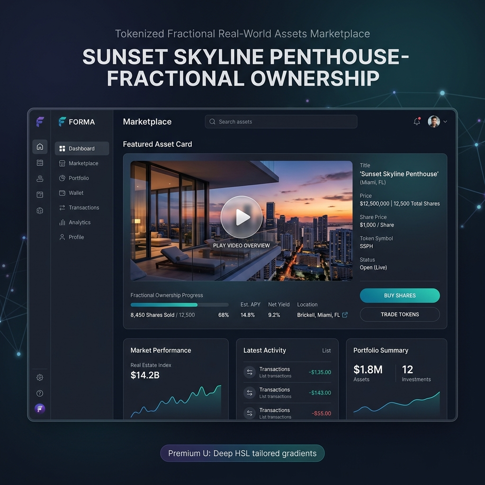
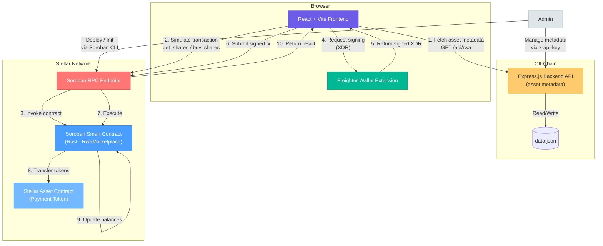

# Tokenized Fractional Real-World Assets (RWA) Marketplace

[](https://opensource.org/licenses/MIT)

A full-stack decentralized application (dApp) built on the **Stellar Network** using **Soroban Smart Contracts**. This marketplace allows administrators to tokenize real-world assets into fractional shares for users to purchase.

> [!WARNING]
> **The smart contract has not been independently audited.** It custodies real
> payment-token funds and holds a privileged admin key. Do not deploy it to
> Stellar mainnet with real user funds until an independent audit has been
> completed and its findings remediated. See
> [Smart Contract Audit Status](#security--audit-status) below.

## Security & Audit Status

The Soroban contract in `contracts/` is **unaudited**: no independent third
party has reviewed it. That is a material risk — the contract custodies
payment-token balances and an admin key that can pause trading, change the
price, raise the share supply and withdraw tokens.

| Component | Audit status |
| --- | --- |
| Smart contract (`contracts/`) | **Unaudited** — no independent review performed |
| Backend API (`backend/`) | Not separately audited |
| Frontend (`frontend/`) | Not separately audited |

The current status, the mainnet risk disclaimer and the policy for re-auditing
after significant contract changes are maintained in
[SECURITY.md](SECURITY.md#smart-contract-audit-status). If you are evaluating a
mainnet deployment, read that before funding the contract.

## Walkthrough Demo

[](assets/marketplace_demo.webp)


## Architecture



### Data Flow — Buying Shares

| Step | Description |
|------|-------------|
| 1 | Frontend fetches asset metadata from the Backend API (`GET /api/rwa`) |
| 2 | User enters share amount and clicks "Buy Shares" |
| 3 | Frontend builds a `buy_shares` transaction and simulates it via Soroban RPC |
| 4 | Frontend sends the transaction XDR to Freighter Wallet for signing |
| 5 | User approves in Freighter; signed XDR is returned |
| 6 | Frontend submits the signed transaction to the Soroban RPC endpoint |
| 7 | Soroban Smart Contract executes `buy_shares`: rejects the buyer if the allowlist is enabled and they are not on it, then validates availability and transfers payment tokens from buyer to admin |
| 8 | The Stellar Asset Contract (payment token) transfers the cost to the admin address |
| 9 | Contract updates the buyer's share balance and available shares count |
| 10 | Frontend refreshes the share balance via `get_shares` (simulate-only, no fee) |

## Project Structure

```
├── contracts/          # Soroban smart contract (Rust)
│   ├── Cargo.toml
│   └── lib.rs
├── backend/            # Off-chain metadata API (Express.js)
│   ├── package.json
│   ├── index.js
│   └── .env.example
├── frontend/           # React + Vite application
│   ├── package.json
│   ├── vite.config.js
│   ├── index.html
│   └── src/
│       ├── main.jsx
│       └── App.jsx
├── .gitignore
└── README.md
```

## Documentation

- [Linux Development Setup and SSH Account Routing](docs/development-setup.md)
- [Jenkins Integration Pipeline](docs/jenkins.md)
- [Contract Resource Benchmarks](docs/contract-benchmarks.md)
- [Architecture Overview & Diagrams](docs/architecture.md)
- [Infrastructure Inventory & IaC Boundary](docs/infrastructure.md) — What is managed by `render.yaml` / Terraform, what is still provisioned by hand, and how to apply the database
- [Architecture Decision Records (ADRs)](docs/adr/README.md) — Technical decisions and rationale
- [Security Policy & Audit Status](SECURITY.md) — Vulnerability reporting, current smart-contract audit status, mainnet risk disclaimer, and re-audit policy
- [Security Best Practices Guide](docs/security.md) — Security guidelines, audit checklist, and incident response
- [Observability Guide](docs/OBSERVABILITY.md) — Structured logging, request IDs, secret redaction, Sentry alerting, and the ELK log pipeline
- [Performance Benchmarks](docs/performance.md) — Gas costs, API latency, frontend metrics
- [CDN Configuration](docs/cdn.md) — Serve frontend assets and uploaded media through Cloudflare
- [Troubleshooting Guide](docs/troubleshooting.md) — Common issues and solutions
- [Incident Response Playbook](docs/incident-response.md) — One coordinated sequence across the contract, backend, and DNS/CDN tiers
- [Contract Address Verification](docs/contract-address-verification.md) — The signed canonical manifest of official contract addresses and how the frontend checks it
- [Multi-Region Deployment](docs/multi-region-deployment.md) — Deployment strategy and failover
- [Kubernetes Deployment](docs/kubernetes-deployment.md) — Kubernetes manifests, scaling, and self-healing
- [Deploying Your Own Instance](docs/deploying-your-own-instance.md) — Checklist for forks running an independent, rebranded production deployment (distinct from local development setup)
- [Database Backup & Restore](docs/backups.md) — Automated backups, S3 offsite storage, retention, and disaster recovery
- [NFT Certificates](docs/NFT_CERTIFICATES.md)
- [NFT Quickstart](docs/NFT_QUICKSTART.md)
- [FAQ](docs/FAQ.md)
- [Contributors Spotlight](CONTRIBUTORS.md) — Recognize the people who make this project possible

## Prerequisites

- Node.js 20.18.0 (pinned in `.nvmrc` / `.node-version`; CI and the Render Blueprint pin the same version — any 20.x >= 20.18.0 works locally)
- Rust
- Soroban CLI (`cargo install --locked soroban-cli`)
- Freighter Wallet browser extension

## Docker (Backend)

The backend can be containerized with the provided `backend/Dockerfile`.

### Quick Start — API + Database + Redis

```bash
# Copy environment template
cp backend/.env.example backend/.env

# Start backend, PostgreSQL, and Redis (dev profile)
docker compose --profile dev up --build

# Or run detached
docker compose --profile dev up --build -d
```

This starts:
- **Backend API** on `http://localhost:3001`
- **PostgreSQL** on `localhost:5432`
- **Redis** on `localhost:6379`

### Standalone Backend

```bash
# Build the image
docker build -t rwa-backend ./backend

# Run the container (copy backend/.env.example to backend/.env first)
docker run -p 3001:3001 --env-file ./backend/.env rwa-backend
```

### Full Stack (Backend + Frontend + Database + Redis)

```bash
# Dev mode with hot-reload frontend
docker compose --profile dev --profile prod up --build

# Production mode with nginx frontend
docker compose --profile prod up --build
```

### With Monitoring (ELK + Prometheus + Grafana)

```bash
docker compose --profile dev --profile monitoring up --build
```

### Useful Commands

```bash
# View running containers
docker compose ps

# View logs
docker compose logs -f backend

# Stop all services
docker compose down

# Stop and remove volumes (fresh start)
docker compose down -v
```

The container runs as a non-root user and includes a health check endpoint at `/health`.

## Getting Started

### 1. Build the Smart Contract

```bash
cd contracts
cargo build --target wasm32-unknown-unknown --release
# OR: soroban contract build
```

### 2. Run Tests

```bash
cd contracts
cargo test
```

### 3. Configure Testnet & Deploy

```bash
soroban network add --global testnet \
  --rpc-url https://soroban-testnet.stellar.org:443 \
  --network-passphrase "Test SDF Network ; September 2015"

soroban keys generate --global admin --network testnet

soroban contract deploy \
  --wasm target/wasm32-unknown-unknown/release/rwa_marketplace.wasm \
  --source admin \
  --network testnet
```

Copy the returned Contract ID (starts with `C`).

### 4. Initialize the Marketplace

```bash
soroban contract invoke \
  --id <YOUR_CONTRACT_ID> \
  --source admin \
  --network testnet \
  -- \
  init \
  --admin $(soroban keys address admin) \
  --payment_token CDLZFC3SYJYDZT7K67VZ75HPJVIEUVNIXF47ZG2FB2RMQQVU2HHGCYSC \
  --price 10000000 \
  --total_shares 100
```

The allowlist is **enabled by default**, so immediately after `init` nobody can buy —
every `buy_shares` call fails with `Address is not whitelisted` until you allowlist a
buyer. Allowlist one, or turn the gate off for non-regulated assets:

```bash
soroban contract invoke --id <YOUR_CONTRACT_ID> --source admin --network testnet -- \
  add_to_allowlist --addr $(soroban keys address buyer)
```

See [Compliance and Regulatory Limitations](#compliance-and-regulatory-limitations) for
what this gate does and does not cover.

### 5. Configure Environment

**Frontend** — copy and fill in `frontend/.env.example` as `frontend/.env`:

```env
VITE_CONTRACT_ID=<YOUR_CONTRACT_ID>
VITE_RPC_URL=https://soroban-testnet.stellar.org:443
VITE_NETWORK_PASSPHRASE="Test SDF Network ; September 2015"
VITE_API_URL=http://localhost:3001
# Optional production CDN for built frontend assets
# VITE_CDN_URL=https://cdn.example.com
```

**Backend** — copy and fill in `backend/.env.example` as `backend/.env`:

```env
PORT=3001
CORS_ORIGINS=http://localhost:5173
ADMIN_API_KEY=<generate-a-strong-random-key>
DATA_FILE=data.json
# Optional CDN for relative image/document metadata URLs
# CDN_URL=https://cdn.example.com
# ASSET_CDN_URL=https://assets-cdn.example.com
```

#### Environment variables

The backend validates its environment **at startup** (`backend/env.js`) and exits
with a clear error listing every problem if a required value is missing or
invalid — it never silently falls back to a development default. Validation is
skipped only when `NODE_ENV=test` so the test suite can run without a full
production environment. Secret values are redacted from the error output.

| Variable | Required | Validation | Notes |
| --- | --- | --- | --- |
| `ADMIN_API_KEY` | ✅ | non-empty, **≥ 16 characters** | Secret. Guards all write endpoints. |
| `CORS_ORIGINS` | ✅ | comma-separated; each entry a valid `http(s)` origin or `*` | No default fallback. |
| `DATA_FILE` | ✅ | relative path ending in `.json`, no `..` | Asset store. `data.json` in production. |
| `PORT` | | integer `1–65535` | Default `3001`. |
| `NODE_ENV` | | `development` \| `test` \| `production` \| `staging` | Default `development`. |
| `LOG_LEVEL` | | `trace` \| `debug` \| `info` \| `warn` \| `error` \| `fatal` \| `silent` | Default `info`. |
| `WEBHOOK_DATA_FILE` | | relative `.json` path, no `..` | Default `webhooks.json`. |
| `CACHE_TTL_SECONDS` | | positive integer | Redis cache TTL. |
| `REDIS_URL` | | `redis://` or `rediss://` | Secret. Enables the Redis cache + distributed rate limiting. |
| `PINATA_JWT` | | non-empty | Secret. IPFS document uploads. |
| `PINATA_GATEWAY` | | `http(s)` URL | Default `https://gateway.pinata.cloud`. |
| `CDN_URL` | | `http(s)` URL | Base URL for relative asset paths. |
| `SENTRY_DSN` | | `http(s)` URL | Secret. Error tracking (logs only when unset). |

Run `cp backend/.env.example backend/.env` and fill in the required values, or
set them in your deployment dashboard (see [`render.yaml`](./render.yaml)).

### 6. Run the Application

```bash
# Backend
cd backend
npm install
npm run dev

# Frontend (in a separate terminal)
cd frontend
npm install
npm run dev
```

Open `http://localhost:5173`, connect your Freighter wallet, and buy shares.

### 7. Run with Nginx Proxy (Optional)

To run the application with rate limiting and basic WAF/DDoS protection, you can use the provided Nginx configuration. Ensure Nginx is installed on your system.

```bash
# Start Nginx using the provided configuration
nginx -c $(pwd)/nginx/nginx.conf
```

This starts an HTTP-only Nginx server on `http://localhost:80` that proxies requests. Use it for local development; production deployments should terminate TLS as described below:
- `/api/*` -> Backend (`http://localhost:3001`) with rate limiting (10 req/s)
- `/*` -> Frontend (`http://localhost:5173`)

### 8. Self-Hosted HTTPS with Nginx

For self-hosted production deployments, use [`nginx/nginx.tls.conf`](nginx/nginx.tls.conf) instead of `nginx/nginx.conf`. The example redirects HTTP to HTTPS, keeps the Let's Encrypt HTTP-01 challenge reachable, and proxies requests to the same backend and frontend ports. Render deployments can continue to rely on Render's TLS termination.

The example below assumes Ubuntu/Debian, a DNS A/AAAA record for both names pointing to this server, and inbound ports 80 and 443 allowed by the firewall. Substitute your real domain and email. Stop any system Nginx service already using these ports; only one Nginx master should listen on them.

Install Nginx and Certbot, create the webroot, then start the application and the plain-HTTP config so Certbot can validate the domain:

```bash
sudo apt update
sudo apt install nginx certbot
sudo mkdir -p /var/www/certbot
sudo nginx -t -c "$(pwd)/nginx/nginx.conf"
sudo nginx -c "$(pwd)/nginx/nginx.conf"
```

Request a certificate for the domain names in the TLS config:

```bash
sudo certbot certonly --webroot -w /var/www/certbot \
  -d example.com -d www.example.com \
  --email admin@example.com --agree-tos --no-eff-email
```

In `nginx/nginx.tls.conf`, replace both `example.com` values in `server_name` with your domain names and update the certificate paths if your certificate's primary name differs. Then stop the HTTP-only Nginx process and start the TLS config:

```bash
HTTP_CONFIG="$(pwd)/nginx/nginx.conf"
TLS_CONFIG="$(pwd)/nginx/nginx.tls.conf"
sudo nginx -s quit -c "$HTTP_CONFIG"
sudo nginx -t -c "$TLS_CONFIG"
sudo nginx -c "$TLS_CONFIG"
```

Certbot packages enable a systemd timer (or equivalent scheduler) for `certbot renew`. Install a deploy hook so Nginx reloads only after a certificate is renewed:

```bash
TLS_CONFIG="$(pwd)/nginx/nginx.tls.conf"
NGINX_BIN="$(command -v nginx)"
sudo install -d /etc/letsencrypt/renewal-hooks/deploy
sudo tee /etc/letsencrypt/renewal-hooks/deploy/reload-repo-nginx >/dev/null <<EOF
#!/bin/sh
$NGINX_BIN -t -c "$TLS_CONFIG" && $NGINX_BIN -s reload -c "$TLS_CONFIG"
EOF
sudo chmod 755 /etc/letsencrypt/renewal-hooks/deploy/reload-repo-nginx
sudo certbot renew --dry-run
```

Keep ports 80 and 443 reachable so HTTP-01 renewal can complete. Check the renewal timer with `systemctl list-timers | grep certbot` and test future renewals with `sudo certbot renew --dry-run`.

## Smart Contract API

| Function | Description | Auth |
|---|---|---|
| `init` | Initialize marketplace | Admin |
| `buy_shares` | Purchase fractional shares (mints NFT certificate per share if configured). Blocked unless the buyer is allowlisted, when the allowlist is enabled | Buyer + Allowlist |
| `add_to_allowlist` | Allow an address to buy shares (alias of `add_to_whitelist`) | Admin |
| `remove_from_allowlist` | Revoke an address's ability to buy (alias of `remove_from_whitelist`) | Admin |
| `add_to_whitelist` | Allow an address to buy shares | Admin |
| `remove_from_whitelist` | Revoke an address's ability to buy | Admin |
| `is_whitelisted` | Check whether an address is allowlisted and unexpired | None |
| `set_allowlist_enabled` | Turn the `buy_shares` allowlist gate on or off | Admin |
| `is_allowlist_enabled` | Whether `buy_shares` enforces the allowlist | None |
| `set_nft_contract` | Configure NFT contract for certificate minting | Admin |
| `get_shares` | Query user balance | None |
| `get_available_shares` | Query remaining shares | None |
| `get_total_shares` | Query total shares | None |
| `get_price` | Query price per share | None |
| `get_admin` | Query the address that currently administers the contract | None |
| `update_price` | Correct the price per share (paused marketplace only) | Admin |
| `increase_total_shares` | Add supply for a follow-on offering (paused marketplace only) | Admin |
| `is_paused` | Check if paused | None |
| `pause` | Pause marketplace | Admin |
| `unpause` | Unpause marketplace | Admin |
| `emergency_withdraw` | Withdraw tokens from contract | Admin |

### Compliance and Regulatory Limitations

**Read this before tokenizing any asset that carries securities-law implications.**

The buyer allowlist is a coarse on-chain access gate, **not** a compliance solution. It
is enabled by default, and `buy_shares` rejects any buyer the admin has not cleared:

```bash
# Approve an address (after completing your own KYC checks off-chain)
soroban contract invoke --id "$CONTRACT_ID" -- add_to_allowlist --address "$BUYER"

# Deployments of non-regulated assets can skip allowlisting entirely
soroban contract invoke --id "$CONTRACT_ID" -- set_allowlist_enabled --address "$ADMIN" -- true false
```

What the allowlist **does not** do, and what you must handle off-chain:

- **No KYC / identity verification.** An address on the allowlist is only as trustworthy
  as the process that put it there. On-chain there is no way to attest that the holder
  is a real person. Identity verification is entirely the deployer's responsibility.
- **No accredited-investor or suitability checks.** The contract cannot evaluate net
  worth, income, or investment experience. A jurisdiction that requires accredited or
  sophisticated-investor status needs that determination made and recorded off-chain
  before an address is allowlisted.
- **No jurisdiction / geofencing.** Addresses carry no verified location, so the contract
  cannot enforce regional restrictions. If an asset may only be held by residents of
  certain countries, that restriction must be enforced by your allowlist process.
- **No transfer-time or holding-period restrictions on secondary transfers.** The gate
  covers `buy_shares` only. `buy_vested_shares` and `batch_buy_shares` enforce the
  allowlist unconditionally, but secondary transfers go through separate functions that
  apply their own (separately managed) transfer allowlist. Do not assume a buy-time
  check constrains later transfers.
- **No investor attestation, subscription-agreement signature, or record-keeping.**
  These are legally required for many offerings and have no on-chain equivalent here.
- **The admin is a single address with unrevoked, unaccountable power over the allowlist.**
  There is no multi-sig or timelock on these calls, and no on-chain identity behind the
  admin address. A compromised admin can allowlist arbitrary addresses or disable the
  gate entirely.

Disabling the allowlist (`set_allowlist_enabled(false)`) makes `buy_shares` permissionless:
any address that can sign a transaction may purchase shares. Only do this for assets with
no securities-law implications. Because the default is *enabled*, forgetting to configure
anything leaves a regulated deployment closed rather than open — but note that a
deployment that never allowlists anyone is also unable to sell to anyone.

**Deploying this contract for a regulated asset is not, on its own, compliance.** You are
responsible for obtaining any required registrations, licences, and legal advice, and for
operating the KYC/AML and suitability processes that the on-chain allowlist assumes exist.

### NFT Share Certificates

When users buy shares, they receive **SEP-41 compliant NFT certificates** representing their ownership. These NFTs can be viewed in wallets, transferred peer-to-peer, and traded on secondary marketplaces.

👉 **[See NFT Certificates Documentation](docs/NFT_CERTIFICATES.md)** for setup, deployment, and integration details.

## Backend API

| Method | Endpoint | Auth | Description |
|---|---|---|---|
| Method | Endpoint | Auth | Description |
|---|---|---|---|
| `GET` | `/health` | No | Health check |
| `GET` | `/api/v1/rwa` | No | List approved assets |
| `GET` | `/api/v1/rwa/:contractId` | No | Get asset metadata |
| `GET` | `/api/v1/rwa/search` | No | Full-text search (facets + relevance) |
| `GET` | `/api/v1/rwa/pending` | `x-api-key` | List assets awaiting review |
| `POST` | `/api/v1/rwa` | `x-api-key` | Create asset |
| `PATCH` | `/api/v1/rwa/:contractId` | `x-api-key` | Partial update (specific fields only) |
| `DELETE` | `/api/v1/rwa/:contractId` | `x-api-key` | Delete asset |

### API Versioning

All resource routes are versioned under **`/api/v1`** — use that prefix for new
integrations. The unversioned `/api/*` paths remain as a backward-compatible
alias of `/api/v1` and return `Deprecation: true` plus a
`Link: </api/v1>; rel="successor-version"` header; every API response carries
`X-API-Version: 1`. Infrastructure endpoints (`/health`, `/metrics`,
`/api-docs*`, `/api/batch`) are intentionally unversioned.

See **[docs/api-versioning.md](docs/api-versioning.md)** for the compatibility
guarantees, the deprecation process, and the procedure for introducing `v2`.

Interactive API documentation is available at [`/api-docs`](http://localhost:3001/api-docs) (Swagger UI) and [`/api-docs.json`](http://localhost:3001/api-docs.json) (raw OpenAPI spec) when the backend is running.

### Example Requests

The examples below run in order against a fresh backend (`ADMIN_API_KEY` exported in
your shell). CI executes every one of them against a locally started backend and fails
the build if a response no longer matches what is shown here — see
[`backend/scripts/verify-readme-examples.js`](backend/scripts/verify-readme-examples.js).
In the expected responses, `"<...>"` stands for a value that varies between runs.

<!-- readme-api-examples:start -->

Check the service is up:

```bash
# Expected status: 200
curl http://localhost:3001/health
```

```json
{
  "status": "ok",
  "timestamp": "<iso-timestamp>",
  "dependencies": { "storage": { "status": "ok" } }
}
```

Create asset metadata (new assets start as `pending`):

```bash
# Expected status: 201
curl -X POST http://localhost:3001/api/rwa \
  -H "Content-Type: application/json" \
  -H "x-api-key: $ADMIN_API_KEY" \
  -d '{
    "contractId": "CA3D5KRYM6CB7OWQ6TWYRR3Z4T7GNZLKERYNZGGA5SOAOPIFY6YQGAXE",
    "title": "Luxury Manhattan Condo Unit 12B",
    "location": "New York, NY",
    "description": "A fully furnished 2-bedroom condo",
    "assetType": "real_estate",
    "totalValuation": "2500000.00"
  }'
```

```json
{
  "contractId": "CA3D5KRYM6CB7OWQ6TWYRR3Z4T7GNZLKERYNZGGA5SOAOPIFY6YQGAXE",
  "title": "Luxury Manhattan Condo Unit 12B",
  "location": "New York, NY",
  "assetType": "real_estate",
  "totalValuation": "2500000.00",
  "status": "pending",
  "createdAt": "<iso-timestamp>"
}
```

Write endpoints reject requests without a valid key:

```bash
# Expected status: 401
curl -X POST http://localhost:3001/api/rwa \
  -H "Content-Type: application/json" \
  -d '{"contractId": "CA3D5KRYM6CB7OWQ6TWYRR3Z4T7GNZLKERYNZGGA5SOAOPIFY6YQGAXE"}'
```

```json
{
  "status": 401,
  "detail": "Unauthorized: invalid or missing API key"
}
```

Pending assets are hidden from the public read endpoints until approved:

```bash
# Expected status: 200
curl -X POST http://localhost:3001/api/rwa/CA3D5KRYM6CB7OWQ6TWYRR3Z4T7GNZLKERYNZGGA5SOAOPIFY6YQGAXE/approve \
  -H "x-api-key: $ADMIN_API_KEY"
```

```json
{
  "contractId": "CA3D5KRYM6CB7OWQ6TWYRR3Z4T7GNZLKERYNZGGA5SOAOPIFY6YQGAXE",
  "status": "approved"
}
```

Fetch a single asset:

```bash
# Expected status: 200
curl http://localhost:3001/api/rwa/CA3D5KRYM6CB7OWQ6TWYRR3Z4T7GNZLKERYNZGGA5SOAOPIFY6YQGAXE
```

```json
{
  "contractId": "CA3D5KRYM6CB7OWQ6TWYRR3Z4T7GNZLKERYNZGGA5SOAOPIFY6YQGAXE",
  "title": "Luxury Manhattan Condo Unit 12B",
  "status": "approved"
}
```

List assets (cursor-paginated):

```bash
# Expected status: 200
curl "http://localhost:3001/api/rwa?limit=10"
```

```json
{
  "data": [
    {
      "contractId": "CA3D5KRYM6CB7OWQ6TWYRR3Z4T7GNZLKERYNZGGA5SOAOPIFY6YQGAXE",
      "title": "Luxury Manhattan Condo Unit 12B"
    }
  ],
  "pagination": { "limit": 10, "total": 1 }
}
```

Update only specific fields:

```bash
# Expected status: 200
curl -X PATCH http://localhost:3001/api/rwa/CA3D5KRYM6CB7OWQ6TWYRR3Z4T7GNZLKERYNZGGA5SOAOPIFY6YQGAXE \
  -H "Content-Type: application/json" \
  -H "x-api-key: $ADMIN_API_KEY" \
  -d '{"totalValuation": "2750000.00"}'
```

```json
{
  "contractId": "CA3D5KRYM6CB7OWQ6TWYRR3Z4T7GNZLKERYNZGGA5SOAOPIFY6YQGAXE",
  "title": "Luxury Manhattan Condo Unit 12B",
  "totalValuation": "2750000.00"
}
```

Delete the asset:

```bash
# Expected status: 200
curl -X DELETE http://localhost:3001/api/rwa/CA3D5KRYM6CB7OWQ6TWYRR3Z4T7GNZLKERYNZGGA5SOAOPIFY6YQGAXE \
  -H "x-api-key: $ADMIN_API_KEY"
```

```json
{
  "message": "Asset metadata deleted",
  "contractId": "CA3D5KRYM6CB7OWQ6TWYRR3Z4T7GNZLKERYNZGGA5SOAOPIFY6YQGAXE"
}
```

<!-- readme-api-examples:end -->

## Cloud Deployment (Render)

This project includes a [`render.yaml`](./render.yaml) Blueprint for one-click deployment to [Render](https://render.com).

For zero-downtime releases, the repository now includes a blue-green deployment workflow described in [docs/blue-green-deployment.md](docs/blue-green-deployment.md). It uses paired blue and green services, health checks before traffic switches, and rollback support.

### Services deployed

| Service | Type | Description |
|---------|------|-------------|
| `rwa-marketplace-backend` | Web Service (Node) | Express.js metadata API |
| `rwa-marketplace-frontend` | Static Site | React + Vite dApp |

### Steps

1. **Fork or push** this repository to your GitHub account.
2. Go to [dashboard.render.com](https://dashboard.render.com) → **New** → **Blueprint**.
3. Connect your repository — Render will detect `render.yaml` automatically.
4. Set the required environment variables in the Render dashboard:

   **Backend:**
   | Variable | Description |
   |----------|-------------|
   | `CORS_ORIGINS` | Your frontend URL, e.g. `https://rwa-marketplace-frontend.onrender.com` |
   | `ADMIN_API_KEY` | Auto-generated by Render — copy it for API calls |

   **Frontend:**
   | Variable | Description |
   |----------|-------------|
   | `VITE_CONTRACT_ID` | Your deployed Soroban contract ID |
   | `VITE_API_URL` | Your backend Render URL, e.g. `https://rwa-marketplace-backend.onrender.com` |

5. Click **Apply** — Render builds and deploys both services.

### Manual deploy trigger

```bash
# Backend
cd backend && npm run deploy

# Frontend
cd frontend && npm run deploy
```

> **Note:** Free-tier Render services spin down after inactivity. Upgrade to a paid plan for always-on availability.

> **Running a fork in production?** The steps above get the upstream code onto Render. To operate an independent, rebranded instance — your own names, domains, contract, legal pages, monitoring, and secrets — follow [docs/deploying-your-own-instance.md](docs/deploying-your-own-instance.md).

## Contributors

We appreciate all contributions! See [CONTRIBUTORS.md](CONTRIBUTORS.md) for the full contributor spotlight. To contribute, please review [CONTRIBUTING.md](CONTRIBUTING.md). Everyone participating in this project is expected to follow our [Code of Conduct](CODE_OF_CONDUCT.md).
