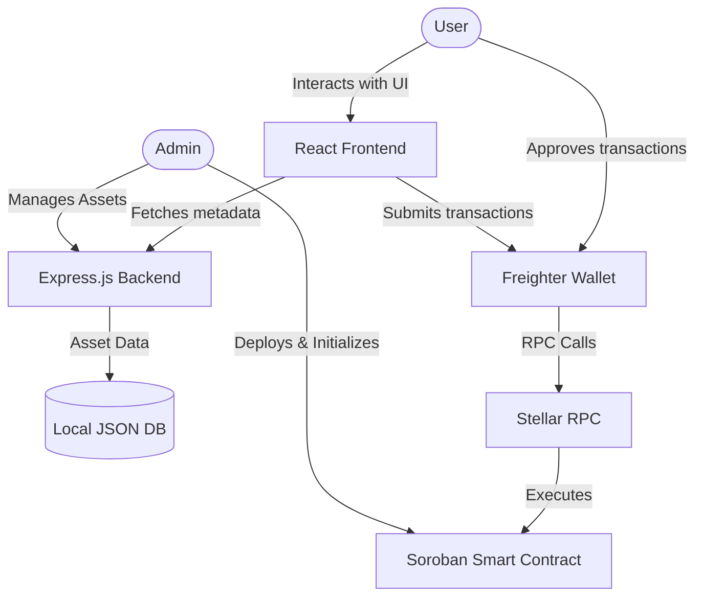
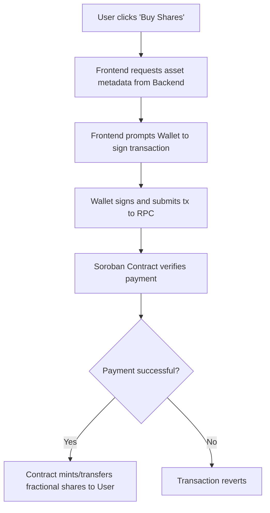
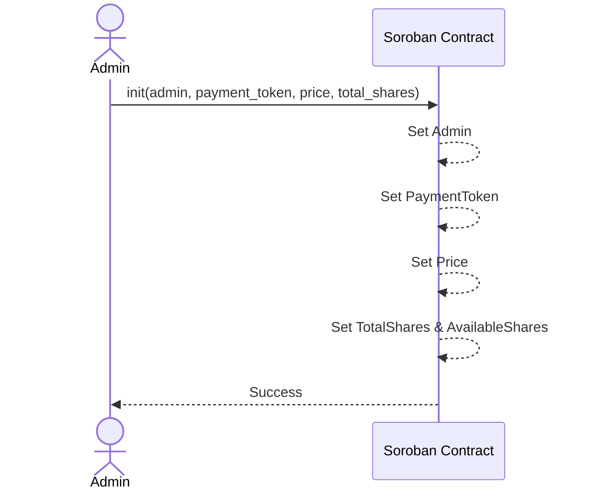
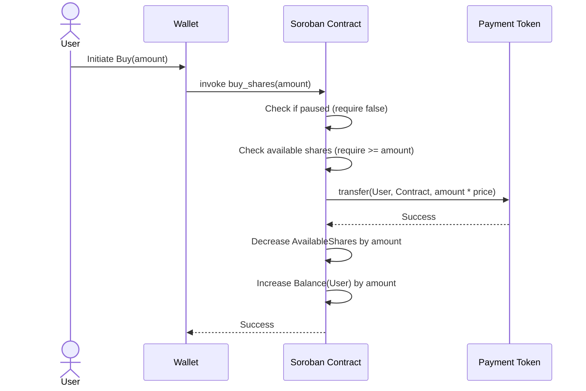

# Architecture Overview

The Tokenized Fractional Real-World Assets (RWA) Marketplace is a decentralized application built on the Stellar Network using Soroban Smart Contracts.

## System Architecture

The system consists of three main components:
1. **Frontend**: React + Vite application that interacts with the user and the Freighter wallet.
2. **Backend**: Express.js server providing off-chain metadata for the tokenized assets.
3. **Smart Contract**: Soroban contract (Rust) on the Stellar Network handling the core logic, ownership, and payments.

## Data Flow Diagrams

### Buy Shares Flow

## Smart Contract Storage Layout

The Soroban smart contract uses the following keys to store data on the ledger:

- `Admin`: The administrator's address with privileges to initialize and pause.
- `PaymentToken`: The address of the token (e.g., USDC) accepted for purchasing shares.
- `Price`: The price per fractional share.
- `TotalShares`: The maximum number of shares available for the asset.
- `AvailableShares`: The current number of shares remaining for purchase.
- `IsPaused`: A boolean indicating if the marketplace is paused.
- `Balance(Address)`: Maps a user's address to their current share balance.

## Sequence Diagrams

### Initialize Marketplace (Admin)

### Purchase Shares (User)

## API Endpoints

### Backend API (REST)

| Method | Endpoint | Auth | Description |
|---|---|---|---|
| `GET` | `/health` | No | Health check for the backend service |
| `GET` | `/api/rwa` | No | List all real-world assets available |
| `GET` | `/api/rwa/:contractId` | No | Get metadata for a specific asset |
| `POST` | `/api/rwa` | `x-api-key` | Create or update asset metadata |
| `DELETE` | `/api/rwa/:contractId` | `x-api-key` | Delete asset metadata |

### Smart Contract Functions

| Function | Access | Description |
|---|---|---|
| `init` | Admin | Initializes the marketplace configuration. |
| `buy_shares` | Any | Purchases a specified amount of shares using the payment token. |
| `get_shares` | Any | Returns the number of shares owned by a user. |
| `get_available_shares` | Any | Returns the remaining shares available for purchase. |
| `get_total_shares` | Any | Returns the total supply of shares for the asset. |
| `get_price` | Any | Returns the price per share. |
| `is_paused` | Any | Returns whether the marketplace is currently paused. |
| `pause` | Admin | Pauses the marketplace to prevent new purchases. |
| `unpause` | Admin | Unpauses the marketplace. |
| `emergency_withdraw` | Admin | Withdraws the accumulated payment tokens from the contract to the admin. |
