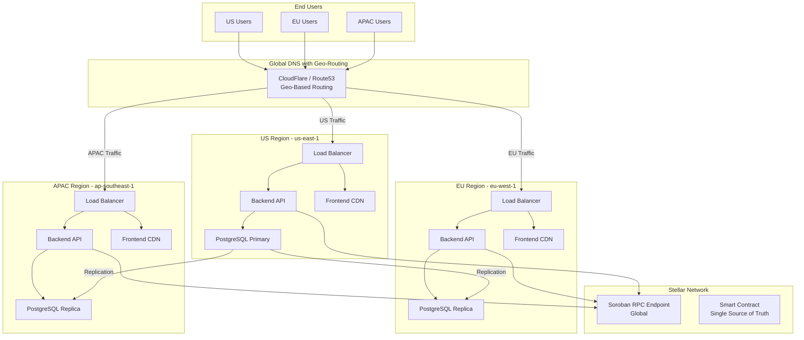
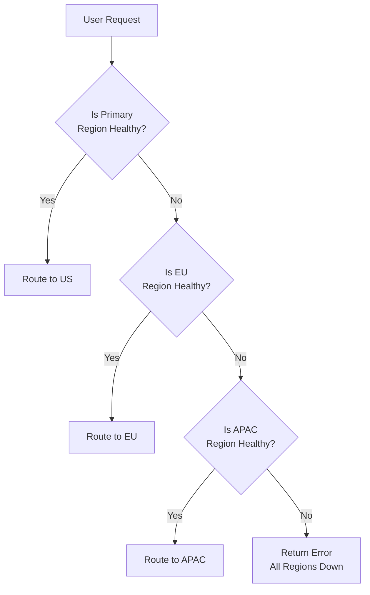

# Multi-Region Deployment Guide

This document describes the strategy for deploying the Tokenized Fractional RWA Marketplace to multiple geographic regions for improved latency, redundancy, and availability.

## Table of Contents

- [Architecture Overview](#architecture-overview)
- [Region Selection](#region-selection)
- [Infrastructure Setup](#infrastructure-setup)
- [Database Replication](#database-replication)
- [DNS and Geo-Routing](#dns-and-geo-routing)
- [Cross-Region Failover](#cross-region-failover)
- [Testing Multi-Region Deployment](#testing-multi-region-deployment)
- [Monitoring and Maintenance](#monitoring-and-maintenance)

---

## Architecture Overview

### Multi-Region Architecture Diagram



### Key Principles

1. **Smart Contract Single Source of Truth**: All regions read/write to the same Soroban contract
2. **Regional Data Caching**: Asset metadata cached in regional databases for read performance
3. **Write-Through Cache**: Writes go to primary US region, then replicate to replicas
4. **Geo-Routing**: DNS directs users to nearest region
5. **Automatic Failover**: If a region fails, traffic redirects to healthy regions

---

## Region Selection

### Recommended Regions

| Region | Provider | Code | Latency Target | Users | Purpose |
|--------|----------|------|----------------|-------|---------|
| **US East** | AWS/Render | us-east-1 | < 50ms | North America | Primary region |
| **EU West** | AWS/Render | eu-west-1 | < 50ms | Europe | High-traffic region |
| **APAC Singapore** | AWS/Render | ap-southeast-1 | < 80ms | Asia-Pacific | Growing market |

### Selection Criteria

- **Latency**: Distance to user base
- **Regulatory compliance**: Data residency requirements (GDPR, etc.)
- **Cost**: Provider pricing in region
- **Feature availability**: Ensure DB replication supported
- **Support**: Regional support availability
- **Network quality**: Internet backbone quality

### Future Expansion

```
Phase 1 (Current):
- US East (Primary)
- EU West (Secondary)
- APAC Singapore (Tertiary)

Phase 2:
- US West (California) for west coast
- Middle East (Dubai)

Phase 3:
- South America (São Paulo)
- Africa (South Africa)
```

---

## Infrastructure Setup

### Per-Region Infrastructure

Each region needs:

1. **Backend API Server** (auto-scaling group)
2. **Static Frontend CDN** (cloudfront/cloudflare)
3. **PostgreSQL Database** (read replica in non-primary)
4. **Load Balancer** (distribute across API instances)
5. **Health Checks** (monitor availability)

### Render Deployment Configuration

#### US Region (Primary)

```yaml
# render.yaml for US region
services:
  # Backend API - US Region
  - type: web
    name: rwa-api-us-east
    runtime: node
    rootDir: backend
    region: us-east
    buildCommand: npm install --production
    startCommand: npm start
    healthCheckPath: /health
    envVars:
      - key: NODE_ENV
        value: production
      - key: REGION
        value: us-east
      - key: DATABASE_URL
        fromService:
          type: postgres
          name: rwa-db-primary
          property: connectionString
      - key: REPLICA_DATABASE_URL
        value: ""  # No replica reads in primary
      - key: IS_PRIMARY_REGION
        value: "true"

  # PostgreSQL - US Region (Primary)
  - type: postgres
    name: rwa-db-primary
    region: us-east
    ipAllowList:
      - "0.0.0.0/0"  # Allow cross-region replication
    backupRetention: 14

  # Frontend CDN - US Region
  - type: web
    name: rwa-frontend-us-east
    runtime: static
    rootDir: frontend
    region: us-east
    buildCommand: npm install && npm run build
    staticPublishPath: dist
    headers:
      - path: /*
        name: Cache-Control
        value: public, max-age=0, must-revalidate
      - path: /assets/*
        name: Cache-Control
        value: public, max-age=31536000, immutable
```

#### EU Region (Replica)

```yaml
# render.yaml snippet for EU region
services:
  # Backend API - EU Region
  - type: web
    name: rwa-api-eu-west
    runtime: node
    rootDir: backend
    region: eu-west
    buildCommand: npm install --production
    startCommand: npm start
    healthCheckPath: /health
    envVars:
      - key: NODE_ENV
        value: production
      - key: REGION
        value: eu-west
      - key: DATABASE_URL
        fromService:
          type: postgres
          name: rwa-db-eu-replica
          property: connectionString
      - key: REPLICA_DATABASE_URL
        value: $DATABASE_URL  # Use replica for reads
      - key: IS_PRIMARY_REGION
        value: "false"

  # PostgreSQL - EU Region (Read Replica)
  - type: postgres
    name: rwa-db-eu-replica
    region: eu-west
    primaryService:
      type: postgres
      name: rwa-db-primary
      region: us-east
    ipAllowList:
      - "0.0.0.0/0"

  # Frontend CDN - EU Region
  - type: web
    name: rwa-frontend-eu-west
    runtime: static
    region: eu-west
    # Same config as US frontend
```

---

## Database Replication

### PostgreSQL Multi-Region Replication

#### Setup Primary Database (US Region)

```bash
# 1. Enable replication in postgresql.conf
wal_level = replica
max_wal_senders = 10
max_replication_slots = 10

# 2. Create replication role
CREATE ROLE replication_user WITH REPLICATION ENCRYPTED PASSWORD 'secure-password';

# 3. Add replica to pg_hba.conf
# Allow connections from replica IPs
host    replication     replication_user    <EU_REPLICA_IP>/32    md5
host    replication     replication_user    <APAC_REPLICA_IP>/32  md5
```

#### Setup Read Replicas

```bash
# For EU Replica
pg_basebackup -h <US_PRIMARY_HOST> -U replication_user -p 5432 \
  -D /var/lib/postgresql/data -Pv -W -R

# Start replica
systemctl start postgresql
```

#### Verification

```sql
-- Check replication status on primary
SELECT slot_name, active, restart_lsn FROM pg_replication_slots;

-- Check replica lag
SELECT EXTRACT(EPOCH FROM (NOW() - pg_last_wal_receive_lsn())) AS replication_lag_sec;
```

### Write Strategy

**All writes go to primary region (US)**:
```javascript
// backend/index.js
const pool = process.env.IS_PRIMARY_REGION === 'true' 
  ? primaryDb 
  : replicaDb;

// Write operations: always use primary
if (method === 'POST' || method === 'PUT' || method === 'DELETE') {
  const result = await primaryDb.query(sql, params);
  // Writes replicate automatically
  return result;
}

// Read operations: use local replica if available
if (method === 'GET') {
  const result = await pool.query(sql, params);
  return result;
}
```

### Replication Monitoring

```bash
# Monitor replication lag
watch -n 1 'psql -c "SELECT slot_name, active FROM pg_replication_slots;"'

# Check WAL files
ls -lah /var/lib/postgresql/data/pg_wal/

# Monitor network throughput
iftop -i eth0
```

---

## DNS and Geo-Routing

### Global DNS Setup

#### Using CloudFlare

1. **Create DNS Zone**
   ```
   Domain: rwa-marketplace.io
   Nameservers: CloudFlare
   ```

2. **Set Up Geo-Routing**
   ```
   API Records:
   - api.rwa-marketplace.io
     - US Traffic (0-90W): rwa-api-us-east.onrender.com
     - EU Traffic (0-30E): rwa-api-eu-west.onrender.com
     - APAC Traffic (30E-180): rwa-api-apac.onrender.com

   Frontend Records:
   - app.rwa-marketplace.io
     - Use CloudFlare Workers for smart routing
   ```

3. **CloudFlare Worker for Geo-Routing**
   ```javascript
   // worker.js
   export default {
     async fetch(request) {
       const clientCountry = request.headers.get('cf-ipcountry');
       const url = new URL(request.url);

       // Route to nearest region
       const regionMap = {
         'US': 'us.rwa-marketplace.io',
         'CA': 'us.rwa-marketplace.io',
         'GB': 'eu.rwa-marketplace.io',
         'DE': 'eu.rwa-marketplace.io',
         'SG': 'apac.rwa-marketplace.io',
         'JP': 'apac.rwa-marketplace.io',
         // Default
         'default': 'us.rwa-marketplace.io'
       };

       const target = regionMap[clientCountry] || regionMap['default'];
       url.host = target;
       return fetch(url);
     }
   };
   ```

#### Using AWS Route 53

1. **Create Hosted Zone**
2. **Set Up Geolocation Routing**
   ```
   Name: api.rwa-marketplace.io
   Type: A
   
   Geolocation Records:
   - Location: North America → points to rwa-api-us-east.onrender.com
   - Location: Europe → points to rwa-api-eu-west.onrender.com
   - Location: Asia Pacific → points to rwa-api-apac.onrender.com
   - Location: Default → points to rwa-api-us-east.onrender.com
   ```

3. **Health Checks**
   ```
   Each region endpoint has health check:
   - Protocol: HTTPS
   - Path: /health
   - Interval: 30 seconds
   - Failure threshold: 3
   ```

### Testing Geo-Routing

```bash
# Simulate request from different regions
curl -H "CF-IPCountry: GB" https://api.rwa-marketplace.io/health
# Should route to EU endpoint

curl -H "CF-IPCountry: JP" https://api.rwa-marketplace.io/health
# Should route to APAC endpoint

# Check actual DNS resolution from different locations
# Use online tools: DNS Checker, MXToolbox
```

---

## Cross-Region Failover

### Automated Failover Strategy



### Implementation

#### 1. Health Check Monitoring

```javascript
// backend/health-check.js
app.get('/health', async (req, res) => {
  const checks = {
    database: await checkDatabase(),
    sorobanRpc: await checkSorobanRPC(),
    cache: await checkCache(),
    memory: process.memoryUsage().heapUsed / process.memoryUsage().heapTotal,
    uptime: process.uptime()
  };

  const isHealthy = 
    checks.database.ok && 
    checks.sorobanRpc.ok && 
    checks.memory < 0.9;  // Alert if > 90% memory

  res.status(isHealthy ? 200 : 503).json({
    status: isHealthy ? 'healthy' : 'unhealthy',
    region: process.env.REGION,
    checks,
    timestamp: new Date().toISOString()
  });
});
```

#### 2. Database Failover

```javascript
// Handle primary DB failure
const pool = require('pg').Pool;

async function executeWithFailover(query, params) {
  try {
    // Try primary first (or local replica for reads)
    return await primaryDb.query(query, params);
  } catch (error) {
    if (error.code === 'ECONNREFUSED') {
      // Primary down, try fallback
      console.error('Primary DB unreachable, using fallback');
      return await fallbackDb.query(query, params);
    }
    throw error;
  }
}
```

#### 3. Circuit Breaker Pattern

```javascript
// Prevent cascading failures
class CircuitBreaker {
  constructor(name, threshold = 5, timeout = 60000) {
    this.name = name;
    this.failureCount = 0;
    this.threshold = threshold;
    this.timeout = timeout;
    this.state = 'CLOSED';  // CLOSED -> OPEN -> HALF_OPEN
    this.nextAttempt = Date.now();
  }

  async execute(fn) {
    if (this.state === 'OPEN') {
      if (Date.now() < this.nextAttempt) {
        throw new Error(`Circuit breaker ${this.name} is OPEN`);
      }
      this.state = 'HALF_OPEN';
    }

    try {
      const result = await fn();
      this.onSuccess();
      return result;
    } catch (error) {
      this.onFailure();
      throw error;
    }
  }

  onSuccess() {
    this.failureCount = 0;
    this.state = 'CLOSED';
  }

  onFailure() {
    this.failureCount++;
    if (this.failureCount >= this.threshold) {
      this.state = 'OPEN';
      this.nextAttempt = Date.now() + this.timeout;
      console.warn(`Circuit breaker ${this.name} opened`);
    }
  }
}

// Usage
const sorobanBreaker = new CircuitBreaker('soroban-rpc');
async function getRwaData() {
  return sorobanBreaker.execute(() => sorobanRpc.getBalance(...));
}
```

---

## Testing Multi-Region Deployment

### Test Scenarios

#### 1. Regional Failover Test

```bash
#!/bin/bash
# test-failover.sh

echo "Testing failover from US to EU..."

# 1. Verify US region is primary
curl -H "CF-IPCountry: US" https://api.rwa-marketplace.io/health

# 2. Simulate US region failure
ssh admin@us-region "systemctl stop application"

# 3. Wait for failover
sleep 5

# 4. Verify traffic now routes to EU
curl -H "CF-IPCountry: US" https://api.rwa-marketplace.io/health
# Should now come from EU region

# 5. Restore US region
ssh admin@us-region "systemctl start application"

# 6. Verify recovery
sleep 10
curl -H "CF-IPCountry: US" https://api.rwa-marketplace.io/health
# Should be back to US
```

#### 2. Database Replication Lag Test

```bash
#!/bin/bash
# test-replication.sh

echo "Checking database replication lag..."

# On primary
psql $PRIMARY_DB -c "SELECT slot_name, restart_lsn FROM pg_replication_slots;"

# On replicas
for replica in $EU_REPLICA $APAC_REPLICA; do
  echo "Checking $replica..."
  psql $replica -c "SELECT NOW() - pg_last_wal_receive_lsn()::text::interval AS replication_lag;"
done

# Alert if lag > 1 second
```

#### 3. Load Testing Across Regions

```bash
#!/bin/bash
# test-load.sh

# Test US endpoint
autocannon https://rwa-api-us-east.onrender.com/api/rwa \
  -d 30 -c 50 --json > us-results.json

# Test EU endpoint
autocannon https://rwa-api-eu-west.onrender.com/api/rwa \
  -d 30 -c 50 --json > eu-results.json

# Test APAC endpoint
autocannon https://rwa-api-apac.onrender.com/api/rwa \
  -d 30 -c 50 --json > apac-results.json

# Compare results
echo "=== Performance Summary ==="
echo "US:   $(cat us-results.json | jq .throughput.average) req/s"
echo "EU:   $(cat eu-results.json | jq .throughput.average) req/s"
echo "APAC: $(cat apac-results.json | jq .throughput.average) req/s"
```

#### 4. Contract Invocation from Multiple Regions

```javascript
// test-contract-multicall.js
const Soroban = require('@stellar/js-soroban-client');

async function testContractFromAllRegions() {
  const regions = [
    { name: 'US', url: 'https://rwa-api-us-east.onrender.com' },
    { name: 'EU', url: 'https://rwa-api-eu-west.onrender.com' },
    { name: 'APAC', url: 'https://rwa-api-apac.onrender.com' }
  ];

  for (const region of regions) {
    console.log(`Testing ${region.name} region...`);
    
    const startTime = Date.now();
    const result = await fetch(`${region.url}/api/rwa/contract/invoke`, {
      method: 'POST',
      body: JSON.stringify({
        method: 'get_shares',
        args: { asset_id: 'asset1' }
      })
    });
    
    const duration = Date.now() - startTime;
    console.log(`  Response time: ${duration}ms`);
    console.log(`  Status: ${result.status}`);
  }
}

testContractFromAllRegions();
```

---

## Monitoring and Maintenance

### Performance Monitoring

#### Dashboards to Create

1. **Regional Performance Dashboard**
   - Response time by region
   - Error rate by region
   - Throughput by region
   - Database replication lag

2. **Availability Dashboard**
   - Uptime % by region
   - Health check status
   - Active incidents
   - Failover events

#### Metrics to Track

```javascript
// Prometheus metrics example
const prometheus = require('prom-client');

const regionResponseTime = new prometheus.Histogram({
  name: 'http_request_duration_seconds',
  help: 'HTTP request latency by region',
  labelNames: ['region', 'method', 'status']
});

const databaseLag = new prometheus.Gauge({
  name: 'database_replication_lag_seconds',
  help: 'Replication lag in seconds',
  labelNames: ['replica_region']
});
```

### Alerting Rules

```yaml
# alerts.yaml
groups:
  - name: multi-region
    rules:
      - alert: RegionDown
        expr: up{job="regional-health"} == 0
        for: 5m
        annotations:
          summary: "Region {{ $labels.region }} is down"

      - alert: HighReplicationLag
        expr: database_replication_lag_seconds > 5
        annotations:
          summary: "Replication lag to {{ $labels.replica }} exceeds 5 seconds"

      - alert: HighErrorRate
        expr: rate(http_requests_total{status=~"5.."}[5m]) > 0.05
        annotations:
          summary: "Error rate in {{ $labels.region }} exceeds 5%"
```

### Maintenance Windows

#### Planned Failover

```bash
# Schedule: Monthly, off-peak hours

# 1. Alert users
echo "Scheduled maintenance: US region failover test"

# 2. Drain connections
systemctl stop application

# 3. Wait for in-flight requests
sleep 30

# 4. Verify traffic routes to EU
curl https://api.rwa-marketplace.io/health

# 5. Resume US region
systemctl start application

# 6. Verify recovery
curl https://api.rwa-marketplace.io/health
```

#### Database Maintenance

```bash
# Monthly on each region:

# 1. Take snapshot
pg_dump $DATABASE_URL > backup-$(date +%Y%m%d).sql

# 2. Vacuum and analyze
psql -c "VACUUM ANALYZE;"

# 3. Check index health
psql -c "SELECT schemaname, tablename, indexname FROM pg_indexes WHERE schemaname = 'public';"

# 4. Verify replication status
psql -c "SELECT * FROM pg_stat_replication;"
```

---

## Deployment Checklist

- [ ] Choose 3+ regions based on user distribution
- [ ] Set up backend/database in each region
- [ ] Configure PostgreSQL replication (primary → replicas)
- [ ] Set up DNS with geo-routing (CloudFlare/Route53)
- [ ] Configure cross-region failover
- [ ] Set up monitoring and alerting
- [ ] Test regional failover scenarios
- [ ] Load test each region
- [ ] Document runbook for incidents
- [ ] Train team on multi-region operations
- [ ] Schedule monthly failover drills

